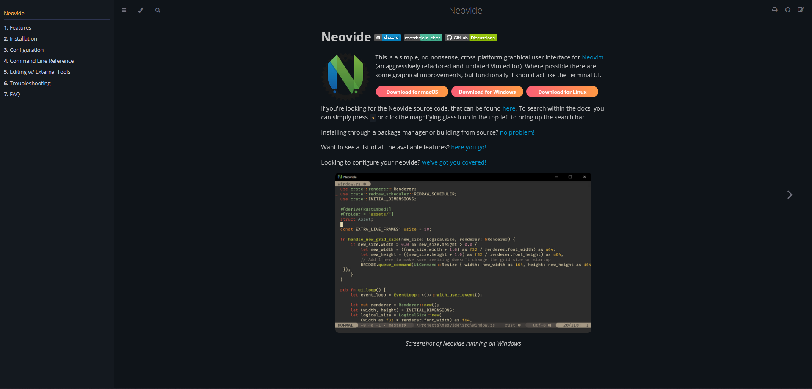

# Neovide Documentation

 This folder is the
source of documentation for Neovide, a simple no-nonsense, cross-platform, graphical editor for
Neovim, hosted on [neovide.dev](https://neovide.dev)

_Note: If you're looking for the Neovide source code, that can be found
[here](https://github.com/neovide/neovide)_

<br><br>

<div align="center">
    
    <em>Screenshot of Landing Page</em>
</div>

## Description

- **./docs** is the source directory of the book
- **./docs/SUMMARY.md** configures the order of the menu on the left hand side of the book
  ([more info here](https://rust-lang.github.io/mdBook/format/summary.html)).
  - "Without this file, there is no book."
- **./docs/assets** stores all the non-markdown content (screenshots, gifs) to be used.
- **./theme** stores general files to be used by mdbook to configure the look and feel of the book
  ([more info here](https://rust-lang.github.io/mdBook/format/theme/index.html)).

### Build

1. Install the latest version of rust on your preferred choice of operating system, we recommend
   using [rustup](https://rustup.rs/)

2. Install required cargo packages to build successfully

   ```sh
   cargo install mdbook --version 0.4.21
   cargo install mdbook-pagetoc --version 0.1.4        # Table of Contents
   cargo install mdbook-linkcheck --version 0.7.6      # Check Links Aren't Broken
   ```

3. Clone the repository

   ```shell
   git clone https://github.com/neovide/neovide
   ```

4. Navigate to root directory

   ```shell
   cd neovide/website/
   ```

5. Build the book and open in default browser

   ```shell
   mdbook build --open
   ```

**Quick Tip!**

To see the website update in real-time while you edit the content, you can use `mdbook serve --open`
instead of the `build` argument

_Note: When making updates to any **.css/.js** files, a full refresh of the browser is needed. This
can be done by pressing <kbd>Ctrl</kbd>-<kbd>F5</kbd>_

## Contributing

This repository makes use of [mdbook](https://rust-lang.github.io/mdBook/index.html), it is _highly_
recommended to read up on mdbook's documentation before contributing. Feel free to ask questions by
joining our [discord](https://discord.gg/SjFpZdQys6) or raising a GitHub issue.

## License

Licensed under the [MIT License](./LICENSE)
