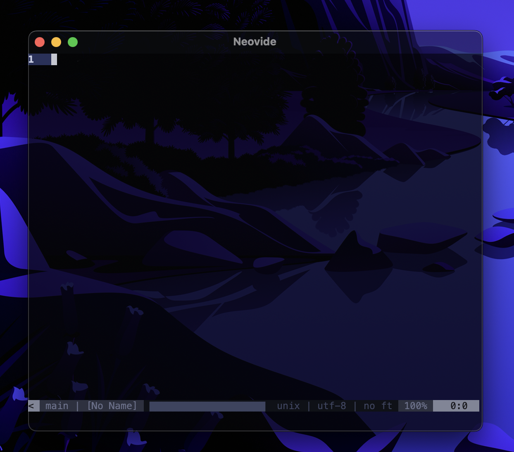

# Configuration

## Global Vim Settings

Neovide supports settings via global variables with a neovide prefix. They enable configuring many
parts of the editor and support dynamically changing them at runtime.

### `init.vim` and `init.lua` helpers

#### Hello, is this Neovide?

Not really a configuration option, but `g:neovide` only exists and is set to `v:true` if this Neovim
is in Neovide. Useful for configuring things only for Neovide in your `init.vim`/`init.lua`:

VimScript:

```vim
if exists("g:neovide")
    " Put anything you want to happen only in Neovide here
endif
```

Lua:

```lua
if vim.g.neovide then
    -- Put anything you want to happen only in Neovide here
end
```

### Display

#### Font

VimScript:

```vim
set guifont=Source\ Code\ Pro:h14
```

Lua:

```lua
vim.o.guifont = "Source Code Pro:h14" -- text below applies for VimScript
```

Controls the font used by Neovide. Only setting which is actually controlled through an option, and
as such it's also documented in `:h guifont`. But to sum it up and also add Neovide's extension:

- The basic format is `Primary\ Font,Fallback\ Font\ 1,Fallback\ Font\ 2:option1:option2:option3`,
  while you can have as many fallback fonts as you want (even 0) and as many options as you want
  (also even 0).
- Fonts
  - are separated with `,` (commas).
  - can contain spaces by either escaping them or using `_` (underscores).
- Options
  - apply to all fonts at once.
  - are separated from the fonts and themselves through `:` (colons).
  - can be one of the following:
    - `hX` — Sets the font size to `X` points, while `X` can be any (even floating-point) number.
    - `b` — Sets the font **bold**.
    - `i` — Sets the font _italic_.
    - `#e-X` (available since 0.10.2) — Sets edge pixels to be drawn opaquely or
      with partial transparency, while `X` is a type of edging:
      - antialias (default)
      - subpixelantialias
      - alias
    - `#h-X` (available since 0.10.2) - Sets level of glyph outline adjustment, while `X` is
      a type of hinting:
      - full (default)
      - normal
      - slight
      - none
- Some examples:
  - `Hack,Noto_Color_Emoji:h12:b` — Hack at size 12 in bold, with Noto Color Emoji as fallback
    should Hack fail to contain any glyph.
  - `Roboto_Mono_Light:h10` — Roboto Mono Light at size 10.
  - `Hack:h14:i:#e-subpixelantialias:#h-none`

#### Line spacing

VimScript:

```vim
set linespace=0
```

Lua:

```lua
vim.opt.linespace = 0
```

Controls spacing between lines, may also be negative.

#### Scale

VimScript:

```vim
let g:neovide_scale_factor = 1.0
```

Lua:

```lua
vim.g.neovide_scale_factor = 1.0
```

**Available since 0.10.2.**

In addition to setting the font itself, this setting allows to change the scale without changing the
whole font definition. Very useful for presentations. See [the FAQ section about
this][scale-runtime] for a nice recipe to bind this to a hotkey.

[scale-runtime]: faq.md#how-can-i-dynamically-change-the-scale-at-runtime

#### Padding

VimScript:

```vim
let g:neovide_padding_top = 0
let g:neovide_padding_bottom = 0
let g:neovide_padding_right = 0
let g:neovide_padding_left = 0
```

Lua:

```lua
vim.g.neovide_padding_top = 0
vim.g.neovide_padding_bottom = 0
vim.g.neovide_padding_right = 0
vim.g.neovide_padding_left = 0
```

**Available since 0.10.4.**

Controls the space between the window border and the actual Neovim, which is filled with the
background color instead.

#### Background Color (Currently macOS only)

VimScript:

```vim
" g:neovide_transparency should be 0 if you want to unify transparency of content and title bar.
let g:neovide_transparency = 0.0
let g:transparency = 0.8
let g:neovide_background_color = '#0f1117'.printf('%x', float2nr(255 * g:transparency))
```

Lua:

```lua
-- Helper function for transparency formatting
local alpha = function()
  return string.format("%x", math.floor(255 * vim.g.transparency or 0.8))
end
-- g:neovide_transparency should be 0 if you want to unify transparency of content and title bar.
vim.g.neovide_transparency = 0.0
vim.g.transparency = 0.8
vim.g.neovide_background_color = "#0f1117" .. alpha()
```

**Available since 0.10.**



Setting `g:neovide_background_color` to a value that can be parsed by
[csscolorparser-rs](https://github.com/mazznoer/csscolorparser-rs) will set the color of the whole
window to that value.

Note that `g:neovide_transparency` should be 0 if you want to unify transparency of content and
title bar.

#### Floating Blur Amount

VimScript:

```vim
let g:neovide_floating_blur_amount_x = 2.0
let g:neovide_floating_blur_amount_y = 2.0
```

Lua:

```lua
vim.g.neovide_floating_blur_amount_x = 2.0
vim.g.neovide_floating_blur_amount_y = 2.0
```

**Available since 0.9.**

Setting `g:neovide_floating_blur_amount_x` and `g:neovide_floating_blur_amount_y` controls the blur
radius on the respective axis for floating windows.

#### Transparency

VimScript:

```vim
let g:neovide_transparency = 0.8
```

Lua:

```lua
vim.g.neovide_transparency = 0.8
```


Setting `g:neovide_transparency` to a value between 0.0 and 1.0 will set the opacity of the window
to that value.

#### Scroll Animation Length

VimScript:

```vim
let g:neovide_scroll_animation_length = 0.3
```

Lua:

```lua
vim.g.neovide_scroll_animation_length = 0.3
```

Sets how long the scroll animation takes to complete, measured in seconds.

#### Hiding the mouse when typing

VimScript:

```vim
let g:neovide_hide_mouse_when_typing = v:false
```

Lua:

```lua
vim.g.neovide_hide_mouse_when_typing = false
```

By setting this to `v:true`, the mouse will be hidden as soon as you start typing. This setting
only affects the mouse if it is currently within the bounds of the neovide window. Moving the
mouse makes it visible again.

#### Underline automatic scaling

VimScript:

```vim
let g:neovide_underline_automatic_scaling = v:false
```

Lua:

```lua
vim.g.neovide_underline_automatic_scaling = false
```

**Available since 0.10.**

Setting `g:neovide_underline_automatic_scaling` to a boolean value determines whether automatic
scaling of text underlines (including undercurl, underdash, etc.) is enabled. Noticeable for font
sizes above 15.

**Note**: This is currently glitchy, and leads to some underlines being clipped by the line of text
below.

### Functionality

#### Refresh Rate

VimScript:

```vim
let g:neovide_refresh_rate = 60
```

Lua:

```lua
vim.g.neovide_refresh_rate = 60
```

Setting `g:neovide_refresh_rate` to a positive integer will set the refresh rate of the app. This is
limited by the refresh rate of your physical hardware, but can be lowered to increase battery life.

Also do note that Neovide's frame pacing is far from optimal at the moment, so better hardware might
not mean better FPS.

#### Idle Refresh Rate

VimScript:

```vim
let g:neovide_refresh_rate_idle = 5
```

Lua:

```lua
vim.g.neovide_refresh_rate_idle = 5
```

**Available since 0.10.**

Setting `g:neovide_refresh_rate_idle` to a positive integer will set the refresh rate of the app
when it is not in focus.

This might not have an effect on every platform (e.g. Wayland).

#### No Idle

VimScript:

```vim
let g:neovide_no_idle = v:true
```

Lua:

```lua
vim.g.neovide_no_idle = true
```

Setting `g:neovide_no_idle` to a boolean value will force neovide to redraw all the time. This can
be a quick hack if animations appear to stop too early.

#### Confirm Quit

VimScript:

```vim
let g:neovide_confirm_quit = v:true
```

Lua:

```lua
vim.g.neovide_confirm_quit = true
```

If set to `true`, quitting while having unsaved changes will require confirmation. Enabled by
default.

#### Fullscreen

VimScript:

```vim
let g:neovide_fullscreen = v:true
```

Lua:

```lua
vim.g.neovide_fullscreen = true
```

Setting `g:neovide_fullscreen` to a boolean value will set whether the app should take up the entire
screen. This uses the so called "windowed fullscreen" mode that is sometimes used in games which
want quick window switching.

#### Remember Previous Window Size

VimScript:

```vim
let g:neovide_remember_window_size = v:true
```

Lua:

```lua
vim.g.neovide_remember_window_size = true
```

Setting `g:neovide_remember_window_size` to a boolean value will determine whether the window size
from the previous session or the default size will be used on startup. The commandline option
`--size` will take priority over this value.

#### Profiler

VimScript:

```vim
let g:neovide_profiler = v:false
```

Lua:

```lua
vim.g.neovide_profiler = false
```

Setting this to `v:true` enables the profiler, which shows a frametime graph in the upper left
corner.

### Input Settings

#### Use Logo Key

VimScript:

```vim
let g:neovide_input_use_logo = v:false  " v:true on macOS
```

Lua:

```lua
vim.g.neovide_input_use_logo = false    -- true on macOS
```

Setting `g:neovide_input_use_logo` to a boolean value will change how logo key (also known as
[super key](<https://en.wikipedia.org/wiki/Super_key_(keyboard_button)>),
[command key](https://en.wikipedia.org/wiki/Command_key) or
[windows key](https://en.wikipedia.org/wiki/Windows_key)) is handled, allowing all key combinations
containing logo to be forwarded to neovim. On MacOS, this defaults to `true` (so that e.g. `cmd+v`
works for pasting with respective setup of `init.vim`), and to `false` for other platforms (that
typically use e.g. `ctrl+v` for pasting).

#### macOS Alt is Meta

VimScript:

```vim
let g:neovide_input_macos_alt_is_meta = v:false
```

Lua:

```lua
vim.g.neovide_input_macos_alt_is_meta = false
```

**Available since 0.10.**

Interprets <kbd>Alt</kbd> + <kbd>whatever</kbd> actually as `<M-whatever>`, instead of sending the
actual special character to Neovim.

#### Touch Deadzone

VimScript:

```vim
let g:neovide_touch_deadzone = 6.0
```

Lua:

```lua
vim.g.neovide_touch_deadzone = 6.0
```

Setting `g:neovide_touch_deadzone` to a value equal or higher than 0.0 will set how many pixels the
finger must move away from the start position when tapping on the screen for the touch to be
interpreted as a scroll gesture.

If the finger stayed in that area once lifted or the drag timeout happened, however, the touch will
be interpreted as tap gesture and the cursor will move there.

A value lower than 0.0 will cause this feature to be disabled and _all_ touch events will be
interpreted as scroll gesture.

#### Touch Drag Timeout

VimScript:

```vim
let g:neovide_touch_drag_timeout = 0.17
```

Lua:

```lua
vim.g.neovide_touch_drag_timeout = 0.17
```

Setting `g:neovide_touch_drag_timeout` will affect how many seconds the cursor has to stay inside
`g:neovide_touch_deadzone` in order to begin "dragging"

Once started, the finger can be moved to another position in order to form a visual selection. If
this happens too often accidentally to you, set this to a higher value like `0.3` or `0.7`.

### Cursor Settings

#### Animation Length

<p align="center">
  
&nbsp; &nbsp;
  
</p>

VimScript:

```vim
let g:neovide_cursor_animation_length = 0.13
```

Lua:

```lua
vim.g.neovide_cursor_animation_length = 0.13
```

Setting `g:neovide_cursor_animation_length` determines the time it takes for the cursor to complete
it's animation in seconds. Set to `0` to disable.

#### Animation Trail Size

<p align="center">
  
&nbsp; &nbsp;
  
</p>

VimScript:

```vim
let g:neovide_cursor_trail_size = 0.8
```

Lua:

```lua
vim.g.neovide_cursor_trail_size = 0.8
```

Setting `g:neovide_cursor_trail_size` determines how much the trail of the cursor lags behind the
front edge.

#### Antialiasing

VimScript:

```vim
let g:neovide_cursor_antialiasing = v:true
```

Lua:

```lua
vim.g.neovide_cursor_antialiasing = true
```

Enables or disables antialiasing of the cursor quad. Disabling may fix some cursor visual issues.

#### Animate in insert mode

VimScript:

```vim
let g:neovide_cursor_animate_in_insert_mode = v:true
```

Lua:

```lua
vim.g.neovide_cursor_animate_in_insert_mode = true
```

If disabled, when in insert mode (mostly through `i` or `a`), the cursor will move like in other
programs and immediately jump to its new position.

#### Animate switch to command line

VimScript:

```vim
let g:neovide_cursor_animate_command_line = v:true
```

Lua:

```lua
vim.g.neovide_cursor_animate_command_line = true
```

If disabled, the switch from editor window to command line is non-animated, and the cursor jumps
between command line and editor window immediately. Does **not** influence animation inside of the
command line.

#### Unfocused Outline Width

VimScript:

```vim
let g:neovide_cursor_unfocused_outline_width = 0.125
```

Lua:

```lua
vim.g.neovide_cursor_unfocused_outline_width = 0.125
```

Specify cursor outline width in `em`s. You probably want this to be a positive value less than 0.5.
If the value is \<=0 then the cursor will be invisible. This setting takes effect when the editor
window is unfocused, at which time a block cursor will be rendered as an outline instead of as a
full rectangle.

### Cursor Particles

There are a number of vfx modes you can enable which produce particles behind the cursor. These are
enabled by setting `g:neovide_cursor_vfx_mode` to one of the following constants.

#### None at all

VimScript:

```vim
let g:neovide_cursor_vfx_mode = ""
```

Lua:

```lua
vim.g.neovide_cursor_vfx_mode = ""
```

The default, no particles at all.

#### Railgun


VimScript:

```vim
let g:neovide_cursor_vfx_mode = "railgun"
```

Lua:

```lua
vim.g.neovide_cursor_vfx_mode = "railgun"
```

#### Torpedo


VimScript:

```vim
let g:neovide_cursor_vfx_mode = "torpedo"
```

Lua:

```lua
vim.g.neovide_cursor_vfx_mode = "torpedo"
```

#### Pixiedust


VimScript:

```vim
let g:neovide_cursor_vfx_mode = "pixiedust"
```

Lua:

```lua
vim.g.neovide_cursor_vfx_mode = "pixiedust"
```

#### Sonic Boom


VimScript:

```vim
let g:neovide_cursor_vfx_mode = "sonicboom"
```

Lua:

```lua
vim.g.neovide_cursor_vfx_mode = "sonicboom"
```

#### Ripple


VimScript:

```vim
let g:neovide_cursor_vfx_mode = "ripple"
```

Lua:

```lua
vim.g.neovide_cursor_vfx_mode = "ripple"
```

#### Wireframe


VimScript:

```vim
let g:neovide_cursor_vfx_mode = "wireframe"
```

Lua:

```lua
vim.g.neovide_cursor_vfx_mode = "wireframe"
```

### Particle Settings

Options for configuring the particle generation and behavior.

#### Particle Opacity

VimScript:

```vim
let g:neovide_cursor_vfx_opacity = 200.0
```

Lua:

```lua
vim.g.neovide_cursor_vfx_opacity = 200.0
```

Sets the transparency of the generated particles.

#### Particle Lifetime

VimScript:

```vim
let g:neovide_cursor_vfx_particle_lifetime = 1.2
```

Lua:

```lua
vim.g.neovide_cursor_vfx_particle_lifetime = 1.2
```

Sets the amount of time the generated particles should survive.

#### Particle Density

VimScript:

```vim
let g:neovide_cursor_vfx_particle_density = 7.0
```

Lua:

```lua
vim.g.neovide_cursor_vfx_particle_density = 7.0
```

Sets the number of generated particles.

#### Particle Speed

VimScript:

```vim
let g:neovide_cursor_vfx_particle_speed = 10.0
```

Lua:

```lua
vim.g.neovide_cursor_vfx_particle_speed = 10.0
```

Sets the speed of particle movement.

#### Particle Phase

VimScript:

```vim
let g:neovide_cursor_vfx_particle_phase = 1.5
```

Lua:

```lua
vim.g.neovide_cursor_vfx_particle_phase = 1.5
```

Only for the `railgun` vfx mode.

Sets the mass movement of particles, or how individual each one acts. The higher the value, the less
particles rotate in accordance to each other, the lower, the more line-wise all particles become.

#### Particle Curl

VimScript:

```vim
let g:neovide_cursor_vfx_particle_curl = 1.0
```

Lua:

```lua
vim.g.neovide_cursor_vfx_particle_curl = 1.0
```

Only for the `railgun` vfx mode.

Sets the velocity rotation speed of particles. The higher, the less particles actually move and look
more "nervous", the lower, the more it looks like a collapsing sine wave.

<!--
  vim: textwidth=100
-->
