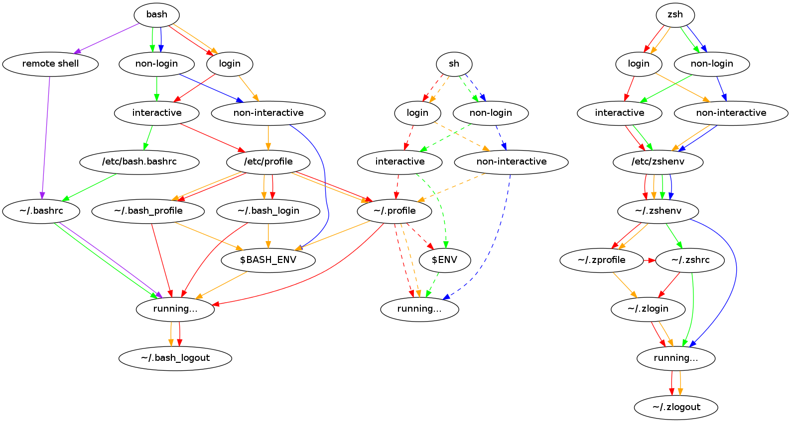

# Frequently Asked Questions

Commonly asked questions, or just explanations/elaborations on stuff.

## How can I use cmd-c/cmd-v to copy and paste?

Neovide doesn't add or remove any keybindings to neovim, it only forwards keys. Its likely that
your terminal adds these keybindings, as neovim doesn't have them by default. We can replicate
this behavior by adding keybindings in neovim.

```lua
if vim.g.neovide then
  local function save() vim.cmd.write() end
  local function copy() vim.cmd([[normal! "+y]]) end
  local function paste() vim.api.nvim_paste(vim.fn.getreg("+"), true, -1) end

  vim.keymap.set({ "n", "i", "v" }, "<D-s>", save, { desc = "Save" })
  vim.keymap.set("v", "<D-c>", copy, { silent = true, desc = "Copy" })
  vim.keymap.set({ "n", "i", "v", "c", "t" }, "<D-v>", paste, { silent = true, desc = "Paste" })
end
```

On Windows/Linux, replace `<D-*>` with `<C-*>` (or `<S-C-*>` in terminals that capture Ctrl).

## How To Enable Floating And Popupmenu Transparency?

Those are controlled through the `winblend` and `pumblend` options. See their help pages for more,
but for short: Both options can be values between `0` (opaque) and `100` (fully transparent),
inclusively on both ends. `winblend` controls the background for floating windows, `pumblend` the
one for the popup menu.

telescope.nvim is different here though. Instead of using the global `winblend` option, it has its
own `telescope.defaults.winblend` configuration option, see [this comment in #1626].

[this comment in #1626]: https://github.com/neovide/neovide/issues/1626#issuecomment-1701080545

## How Can I Dynamically Change The Scale At Runtime?

Neovide offers the setting `g:neovide_scale_factor`, which is multiplied with
the OS scale factor and the font size. So using this could look like

VimScript:

```vim
let g:neovide_scale_factor=1.0
function! ChangeScaleFactor(delta)
  let g:neovide_scale_factor = g:neovide_scale_factor * a:delta
endfunction
nnoremap <expr><C-=> ChangeScaleFactor(1.25)
nnoremap <expr><C--> ChangeScaleFactor(1/1.25)
```

Lua:

```lua
vim.g.neovide_scale_factor = 1.0
local change_scale_factor = function(delta)
  vim.g.neovide_scale_factor = vim.g.neovide_scale_factor * delta
end
vim.keymap.set("n", "<C-=>", function()
  change_scale_factor(1.25)
end)
vim.keymap.set("n", "<C-->", function()
  change_scale_factor(1/1.25)
end)
```

Credits to [BHatGuy here](https://github.com/neovide/neovide/pull/1589).

## How can I Dynamically Change The Transparency At Runtime? (macOS)

from Nightly release `g:neovide_background_color` has been removed. To adjust the window
transparency at runtime on macOS you only need to update `g:neovide_opacity` (and optionally
`g:neovide_normal_opacity` for the editor background). Here is a simple example that binds the
Command-`]`/Command-`[` keys to tweak the opacity:

VimScript:

```vim
let g:neovide_opacity = 0.8

function! ChangeTransparency(delta)
  let g:neovide_opacity = g:neovide_opacity + a:delta
  if g:neovide_opacity > 1
    let g:neovide_opacity = 1
  elseif g:neovide_opacity < 0
    let g:neovide_opacity = 0
  endif
endfunction

nnoremap <silent> <D-]> :call ChangeTransparency(0.01)<CR>
nnoremap <silent> <D-[> :call ChangeTransparency(-0.01)<CR>
```

Lua:

```lua
vim.g.neovide_opacity = 0.8

local change_transparency = function(delta)
  local next_value = (vim.g.neovide_opacity or 1) + delta
  vim.g.neovide_opacity = math.min(1, math.max(0, next_value))
end

vim.keymap.set({ "n", "v", "o" }, "<D-]>", function()
  change_transparency(0.01)
end, { desc = "Increase Neovide opacity" })
vim.keymap.set({ "n", "v", "o" }, "<D-[>", function()
  change_transparency(-0.01)
end, { desc = "Decrease Neovide opacity" })
```

## How To Enable Preedit Support Of IME?

By default, the IME preedit event—that is, the preview of the text being composed—is not
implemented. You can implement this preview yourself by using preedit_handler().

Example:

```lua
local ime_context = {
  base_col = 0,
  base_row = 0,
  preedit_col = 0,
  preedit_row = 0,
}

---@param preedit_raw_text string
---@param cursor_offset [integer, integer]: [start_col, end_col]
preedit_handler = function(preedit_raw_text, cursor_offset)
    vim.api.nvim_buf_set_text(
      0,
      ime_context.base_row - 1,
      ime_context.base_col,
      ime_context.preedit_row - 1,
      ime_context.preedit_col,
      {}
    )
    ime_context.preedit_col = ime_context.base_col + string.len(preedit_raw_text)
    vim.api.nvim_buf_set_text(
      0,
      ime_context.base_row - 1,
      ime_context.base_col,
      ime_context.base_row - 1,
      ime_context.base_col,
      { preedit_raw_text }
    )
    vim.api.nvim_win_set_cursor(0, { ime_context.preedit_row, ime_context.preedit_col })
end
```

Neovide also exposes a Lua function called commit_handler() in addition to preedit_handler(). For
details, see [IME handling on the API page](api.html#ime-handling).

If you’d prefer not to set this up yourself, you can use
[sevenc-nanashi/neov-ime.nvim](https://github.com/sevenc-nanashi/neov-ime.nvim). Please refer to that
repository for more information. Example: Installation with Lazy.nvim

```lua
return {
  "sevenc-nanashi/neov-ime.nvim",
}
```

Related: [PR #3110](https://github.com/neovide/neovide/pull/3110), [PR #3221](https://github.com/neovide/neovide/pull/3221)

## Neovide Is Not Picking Up Some Shell-configured Information

...aka `nvm use` doesn't work, aka anything configured in `~/.bashrc`/`~/.zshrc`
is ignored by Neovide.

Neovide doesn't start the embedded neovim instance in an interactive shell, so your
shell doesn't read part of its startup file (`~/.bashrc`/`~/.zshrc`/whatever the
equivalent for your shell is). But depending on your shell there are other
options for doing so, for example for zsh you can just put your relevant content
into `~/.zprofile` or `~/.zlogin`.

## The Terminal Displays Fallback Colors/:terminal Does Not Show My Colors

Your colorscheme has to define `g:terminal_color_0` through
`g:terminal_color_15` in order to have any effect on the terminal. Just setting
any random highlights which have `Term` in name won't help.

Some colorschemes think of this, some don't. Search in the documentation of
yours, if it's your own, add it, and if you can't seem to find anything, open an
issue in the colorscheme's repo.

## Compose key sequences do not work

One possible cause might be inconsistent capitalization of your locale
settings, see [#1896]. Possibly you're also running an outdated version of
Neovide.

[#1896]: https://github.com/neovide/neovide/issues/1896#issuecomment-1616421167.

Another possible cause is that you are using IME on X11. Dead keys with IME is
not yet supported, but you can work around that either by disabling IME or
configuring it to only be enabled in insert mode. See
[Configuration](configuration.md).

## Font size is weird with high dpi display on x11

Winit looks in multiple locations for the configured dpi.
Make sure its set in at least one of them. More details
here: [#2010](https://github.com/neovide/neovide/issues/2010#issuecomment-1704416685).

## Neovide fails to start with OpenGL/GLX

If Neovide panics on startup with errors like the one below, or X11 errors such
as `GLXBadFBConfig` or `BadMatch`, your system is likely exposing an older
OpenGL version. Neovide requires OpenGL 3.3 and many virtualized setups
(UTM/QEMU/virgl) only expose OpenGL 2.1.

```text
Neovide panicked with the message 'Failed to create OpenGL context'
```

A workaround for Mesa drivers exists:

```bash
MESA_GL_VERSION_OVERRIDE=3.3 MESA_GLSL_VERSION_OVERRIDE=330 neovide
```

If that does not work, your graphics stack may not support OpenGL 3.3

See [#2068](https://github.com/neovide/neovide/issues/2068) and
[#2008](https://github.com/neovide/neovide/issues/2008) for discussion
about improving detection and/or lowering the requirement.

## How to turn off all animations?

Animations can be turned off by setting the following global
variables:

```lua
vim.g.neovide_position_animation_length = 0
vim.g.neovide_cursor_animation_length = 0.00
vim.g.neovide_cursor_trail_size = 0
vim.g.neovide_cursor_animate_in_insert_mode = false
vim.g.neovide_cursor_animate_command_line = false
vim.g.neovide_scroll_animation_far_lines = 0
vim.g.neovide_scroll_animation_length = 0.00
```

## The default Neovim background is dark on a light Gnome theme

Gnome does not support a genuine light theme. See [this Gnome
issue](https://gitlab.gnome.org/GNOME/gnome-control-center/-/issues/1948). You can work around it by
setting it manually with `gsettings set org.gnome.desktop.interface color-scheme prefer-light`.
But do note that it resets when you change the Gnome theme.

## macOS Login Shells

Traditionally, Unix shells use two main configuration files that are executed
before a user can interact with the shell: a profile file and an rc file.

- **Profile File:** This file is typically executed once at login to set up
  the user's environment.
- **RC File:** This file is executed every time a new shell is created to
  configure the shell itself.

In the case of Zsh, which has been the default shell on macOS since version
10.15, the configuration files used are `.zprofile` and `.zshrc`.

### Bash Differences

Unlike Zsh, Bash behaves differently. It only reads `.bashrc` if the shell
session is both interactive and non-login. This distinction might have been
overlooked when macOS transitioned from tcsh to bash in OSX 10.2 Jaguar,
leading developers to place their setup entirely in `.profile` since `.bashrc`
would rarely be executed, especially when starting a new terminal.

With the shift to Zsh as the default shell, both `.zprofile` and `.zshrc` are
executed when starting an interactive non-login shell.



_Regarding to the moment when Neovide launches, it does not start an
interactive shell session, meaning the .bashrc file is not executed. Instead,
the system reads the .bash_profile file. This behavior stems from the
difference in how interactive and login shells process configuration files._

### macOS Specifics

On macOS, the graphical user interface used for system login does not execute
`.zprofile`, as it employs a different method for loading system-level global
settings. This means that terminal emulators must run shells as login shells
to ensure that new shells are properly configured, avoiding potential issues
from missing setup processes in `.zprofile`. This necessity arises because
there is no `.xsession` or equivalent file on macOS to provide initial
settings or global environment variables to terminal sessions[^1].

[^1]: [Why are interactive shells on OSX login shells by default?](https://unix.stackexchange.com/questions/119627/why-are-interactive-shells-on-osx-login-shells-by-default)
