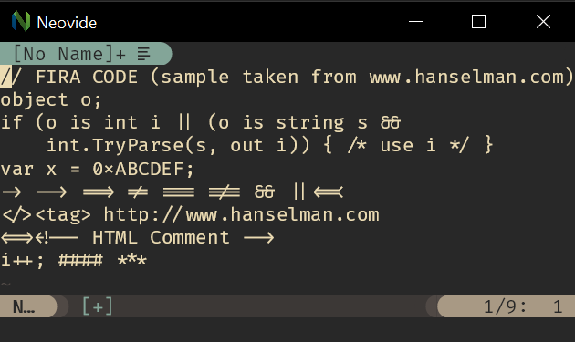
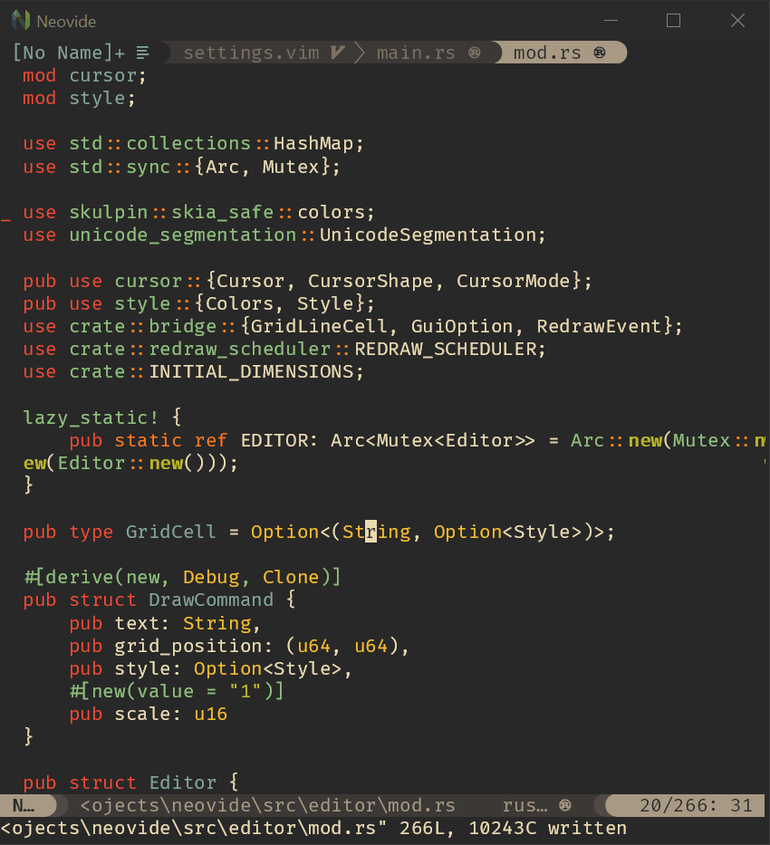
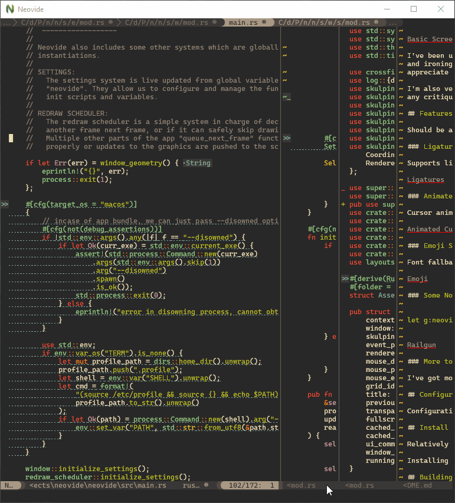
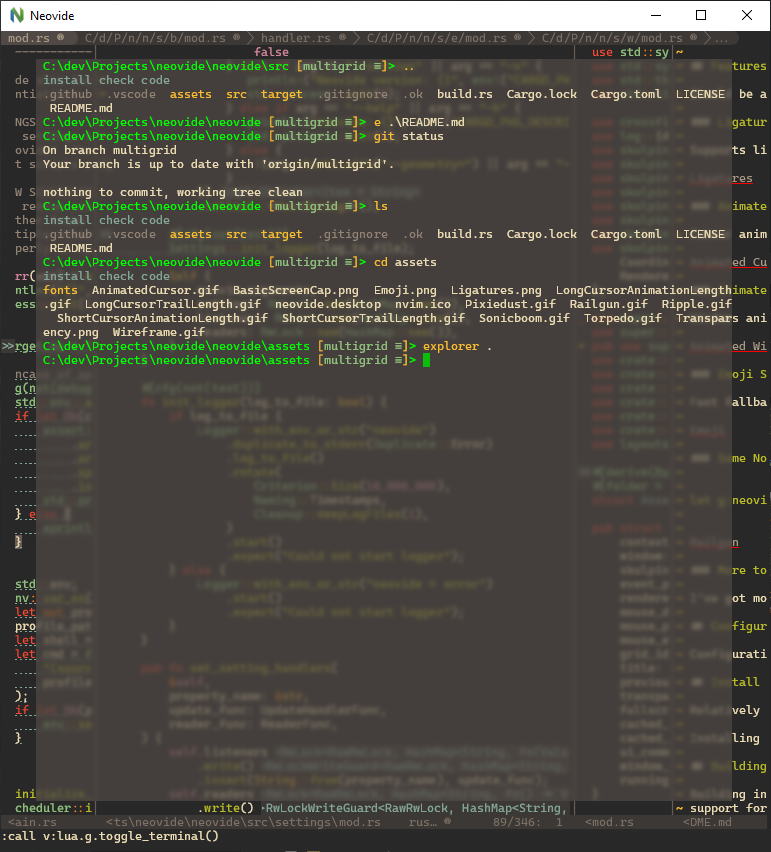
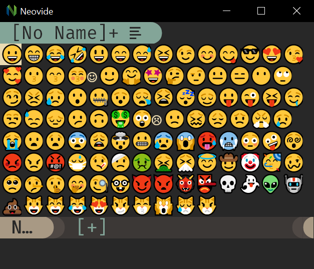

# Features

This should be a standard, fully-featured Neovim GUI. Beyond that there are some visual niceties
listed below :)

## Ligatures

Supports ligatures and font shaping.



## Animated Cursor

Cursor animates into position with a smear effect to improve tracking of cursor position.



## Smooth Scrolling

Scroll operations on buffers in neovim will be animated smoothly pixel wise rather than line by line
at a time.

Note: [multigrid](command-line-reference.md#multigrid) must be enabled for this to work.


## Animated Windows

Windows animate into position when they are moved making it easier to see how layout changes happen.

Note: [multigrid](command-line-reference.md#multigrid) must be enabled for this to work.



## Blurred Floating Windows

The backgrounds of floating windows are blurred improving the visual separation between foreground
and background from built in window transparency.

Note: [multigrid](command-line-reference.md#multigrid) must be enabled for this to work.



## Emoji Support

Font fallback supports rendering of emoji not contained in the configured font.



## WSL Support

Neovide supports displaying a full gui window from inside wsl via the `--wsl` command argument.
Communication is passed via standard io into the wsl copy of neovim providing identical experience
similar to Visual Studio Code's
[Remote Editing](https://code.visualstudio.com/docs/remote/remote-overview).

## Connecting to an existing Neovim instance

Neovide supports connecting to an already running instance of Neovim through the following
communication channels:

* TCP
* Unix domain sockets (Unix-like platforms only)
* Named pipes (Windows only)

This is enabled by specifying the `--server <address>` command line argument. The `address` is
interpreted as a TCP/IPv4/IPv6 address if it contains a colon `:`. Otherwise, it's
interpreted as a Unix domain socket path on Unix-like systems and as the name of a pipe on
Windows systems.

It's possible to quit the GUI while leaving the Neovim instance running by closing the Neovide
application window instead of issuing a `:q` command.

One use case is to attach a GUI running on a local machine to a Neovim instance on a remote machine
over the network.

### TCP Example

Note that exposing Neovim over TCP, even on localhost, is inherently less secure than using Unix
Domain Sockets.

Launch Neovim as a TCP server (on port 6666) by running:

```sh
nvim --headless --listen localhost:6666
```

And then connect to it using:

```sh
/path/to/neovide --server=localhost:6666
```

By specifying to listen on localhost, you only allow connections from your local computer. If you
are actually doing this over a network you will want to use SSH port forwarding for security, and
then connect as before.

```sh
ssh -L 6666:localhost:6666 ip.of.other.machine nvim --headless --listen localhost:6666
```

### Unix Domain Socket Example

Launch a Neovim instance listening on a Unix Domain Socket:

```sh
nvim --headless --listen some-existing-dir/my-nvim-instance.sock
```

And then connect to it using:

```sh
/path/to/neovide --server=some-existing-dir/my-nvim-instance.sock
```

Like TCP sockets, Unix Domain Sockets can be forwarded over SSH. Start a Neovim instance on another
host with:

```sh
ssh -L /path/to/local/socket:/path/to/remote/socket ip.of.other.machine \
    nvim --headless --listen /path/to/remote/socket
```

Then connect with:

```sh
/path/to/neovide --server=/path/to/local/socket
```

### Windows Named Pipes Example

Launch a Neovim instances listening on a Named Pipe:

```cmd
nvim --headless --listen //./pipe/some-known-pipe-name/with-optional-path
```

And then connect to it using:

```cmd
/path/to/neovide --server=some-known-pipe-name/with-optional-path
```

Note: the pipe name passed to nvim must be prefixed with `//./pipe/` but the server argument to
Neovide will add it if it is missing.

## Some Nonsense ;)

To learn how to configure the following, head on over to the
[configuration](./configuration.md#cursor-particles) section!

### Railgun


### Torpedo


### Pixiedust


### Sonic Boom


### Ripple


### Wireframe


