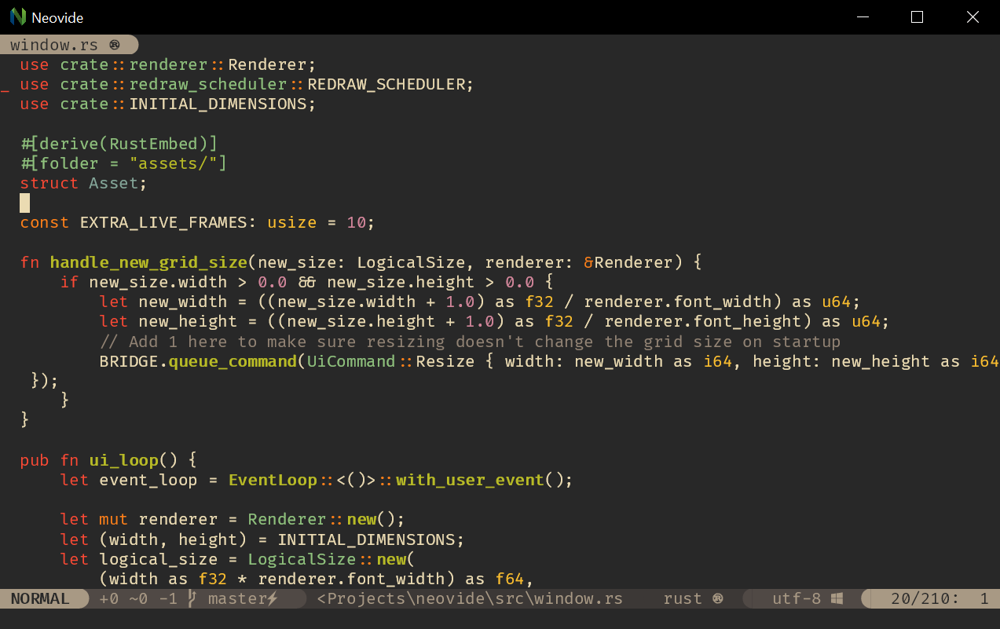

    <h1>
        
        Neovide
    </h1>
    
    
    

    <h1>Neovide
        
        
        
    </h1>

    

This is a simple, no-nonsense, cross-platform graphical user interface for
[Neovim](https://github.com/neovim/neovim) (an aggressively refactored and updated Vim editor).
Where possible there are some graphical improvements, but functionally it should act like the
terminal UI.

    <a href="https://github.com/neovide/neovide/releases/latest/download/Neovide-aarch64-apple-darwin.dmg">
        <button class="button-hover color">Download for macOS</button>
    </a>
    <a href="https://github.com/neovide/neovide/releases/latest/download/neovide.msi">
        <button class="button-hover color">Download for Windows</button>
    </a>
    <a href="https://github.com/neovide/neovide/releases/latest/download/neovide.AppImage">
        <button class="button-hover color">Download for Linux</button>
    </a>

If you're looking for the Neovide source code, that can be found
[here](https://github.com/neovide/neovide). To search within the docs, you can simply press `s` or
click the magnifying glass icon in the top left to bring up the search bar.

Installing through a package manager or building from source? [no problem!](installation.md)

Want to see a list of all the available features? [here you go!](features.md)

Looking to configure your neovide? [we've got you covered!](configuration.md)

    
    
<em>Screenshot of Neovide running on Windows<em>

